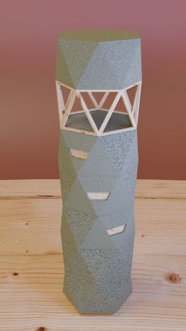

March 2023: **My ([uwsd](https://www.linkedin.com/in/uwe-wlaschny-1a949a19a/)) workouts on:**

> ## Learn how to create realistic furniture unit
By **Marwan Hussein**, [Free Udemy Blender Course](https://www.udemy.com/course/blender-learn-how-to-create-realistic-furniture-unit/)

---

## Summary

I think as absolute beginner with zero knowledge about blender you will have some problems with this course. Section 3 in particular was too bloated. A lot of talking but little showing. But on the other side with minimal knowledge about blender it is a good starting course to deepen knowledge. With the **Post Processing** chapter the tutor shows us, what we can expect if we continue on our path.

## Themed

- Modeling (among others using **Knife tool**)
- Texturing (some simple nodes for gradient texturing, simple wood texturing for the unit)
- Rendering (**cycles**)
- Postprocessing (**rgb_curves**, **color balance**)

## My render

